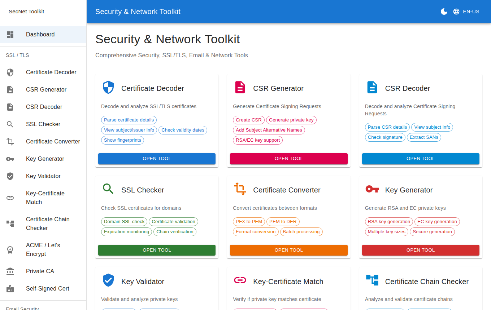
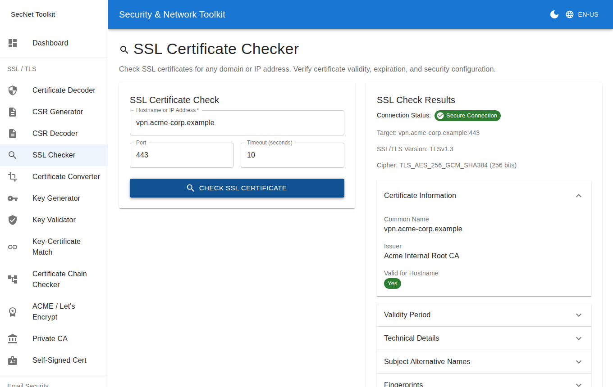
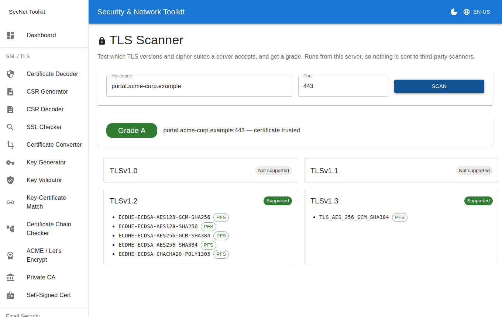
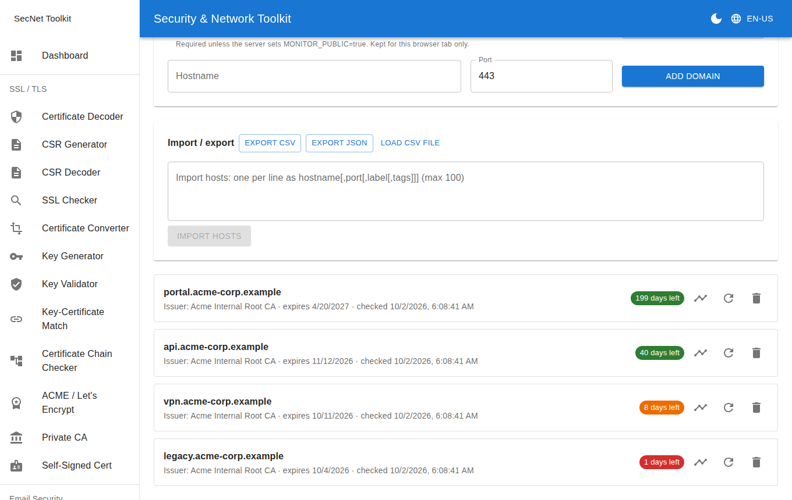
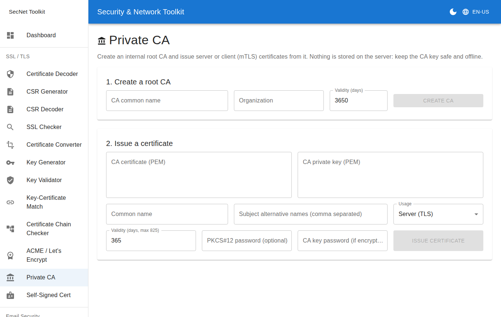
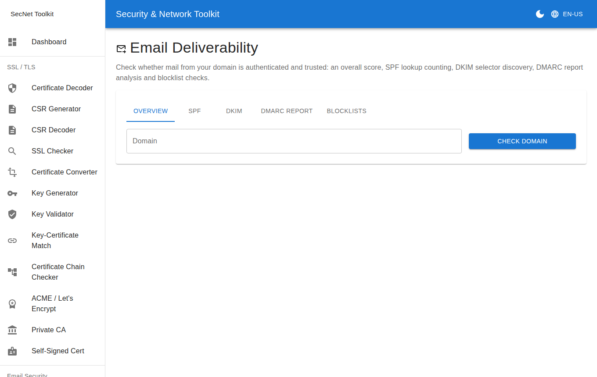

<div align="center">

# Security & Network Toolkit

**A self-hosted toolkit for SSL/TLS certificates, email security and network diagnostics.**<br>
Decode, check, scan, issue and monitor certificates, and fix mail-authentication problems, from a web UI, a REST API or the command line.

[](https://github.com/karlocizma/ssl-toolkit/actions/workflows/ci.yml)
[](LICENSE)


[](CONTRIBUTING.md)

[Quick start](#quick-start) · [Features](#features) · [API docs](#api-reference) · [CLI](#command-line) · [Contributing](CONTRIBUTING.md) · [Security policy](SECURITY.md)



</div>

> Nothing is sent to third-party scanners and nothing sensitive is stored: private keys, ACME account keys and issued certificates are returned to you and never kept on the server.

---

## Table of Contents

- [Screenshots](#screenshots)
- [Features](#features)
- [Architecture](#architecture)
- [Quick Start](#quick-start)
- [Development Setup](#development-setup)
- [Configuration](#configuration)
- [API Reference](#api-reference)
- [Command line](#command-line)
- [Security](#security)
- [Deployment](#deployment)
- [Troubleshooting](#troubleshooting)
- [Roadmap](#roadmap)
- [Contributing](#contributing)

---

## Screenshots

Sample data from a local demo environment (fictional `acme-corp.example` hosts, internal CA).

| | |
|---|---|
| <br>**SSL Checker**: live certificate, chain, cipher and hostname check | <br>**TLS Scanner**: protocol and cipher support with an A–F grade |
| <br>**Domain Monitor**: scheduled checks, history, change detection and alerts | <br>**Private CA**: internal root CA, server and client certificates, nothing stored |
| <br>**Email Deliverability**: SPF, DKIM, DMARC, MTA-STS and TLS-RPT in one score | |

---

## Features

### SSL / TLS Tools

| Tool | Description |
|------|-------------|
| Certificate Decoder | Parse and display full certificate details (subject, issuer, validity, SANs, fingerprints) |
| CSR Generator | Generate Certificate Signing Requests with a new RSA or EC private key |
| CSR Decoder | Parse and display CSR content |
| SSL Checker | Live SSL check for any domain — chain, expiry, cipher info |
| Certificate Converter | Convert between PEM, DER, and PFX/PKCS12 formats |
| Key Generator | Generate RSA (2048/4096) or EC (P-256/P-384/P-521) private keys |
| Key Validator | Validate a private key and report its type and size |
| Key–Certificate Match | Verify that a private key matches a given certificate |
| Certificate Chain Checker | Validate the full certificate chain for a domain |
| Self-Signed Cert Generator | Generate self-signed X.509 certificates with custom SANs |
| TLS Scanner | Test supported TLS versions and cipher suites, weak-cipher and forward-secrecy detection, A–F grade |
| Security Headers | Audit HSTS, CSP, framing, referrer policy and cookie flags with a 0–100 score |
| Chain Builder | Build a correct, ordered `fullchain.pem`: fetches missing intermediates (AIA), checks the Mozilla trust store, repairs a server's chain |
| CT Lookup | Every certificate ever logged in Certificate Transparency for a domain, subdomain discovery, unexpected-CA alerts, one-click add to the monitor |
| Private CA | Create an internal root CA and issue server / client (mTLS) certificates, sign CSRs, export PKCS#12. Nothing is stored |
| ACME / Let's Encrypt | Issue certificates (manual dns-01/http-01 or automatic via Cloudflare, RFC 2136, acme-dns), wildcards, external account binding, renewal-window check. Nothing is stored |
| Domain Monitor | Scheduled re-checks of live domains with expiry history, renewal/issuer-change detection, email and webhook alerts, CSV/JSON export and import, Prometheus metrics |

### Email Security Tools

| Tool | Description |
|------|-------------|
| DMARC Manager | Generate and validate DMARC policies via DNS lookup or inline |
| SPF Manager | Build and validate SPF TXT records |
| Email Header Analyzer | Parse email headers, trace hops, and check authentication results |
| DKIM Manager | Generate RSA DKIM key pairs and validate existing DKIM records |
| Email Deliverability | Overall score (MX, SPF, DKIM, DMARC, MTA-STS, TLS-RPT), SPF DNS-lookup counter, DKIM selector discovery, DMARC aggregate report parser, DNS blocklist checks |
| Autodiscover Check | Outlook Autodiscover, Thunderbird autoconfig and RFC 6186 SRV lookups with a step-by-step report |

### Network & Security Tools

| Tool | Description |
|------|-------------|
| Password Toolkit | Secure password generation, strength analysis, and hashing |
| DNS Diagnostics | Look up A, AAAA, MX, TXT, NS, and other DNS record types |
| SSL Config Generator | Generate production-ready Nginx, Apache, HAProxy, Caddy or Traefik TLS config snippets |
| JWT Decoder | Decode JWT header and payload in-browser, with expiry status chip |

### Advanced API Features

- **OCSP / CRL Revocation Checking** — verify certificate revocation in real time
- **Certificate Monitoring** — track certificates and list those expiring within N days
- **Batch Processing** — process up to 50 certificates or 20 domains in a single request
- **API Key Management** — generate, revoke, and rate-limit by key

---

## Architecture

```
Browser
  │
  ▼
Nginx (:80)
  ├── /api/*  ──► Flask backend (:5000)
  └── /*      ──► React static frontend (served by nginx)
```

Three Docker containers managed by Compose:

| Container | Image | Role |
|-----------|-------|------|
| `nginx` | `nginx:alpine` | Reverse proxy + static frontend |
| `backend` | custom Python | Flask/Gunicorn API server |
| `frontend` | build artifact | React app compiled into nginx image |

**Key source files:**

| Path | Purpose |
|------|---------|
| `nginx/nginx.conf` | Proxy rules; HTTPS block is present but commented out |
| `backend/app/__init__.py` | Flask app factory, rate limiter setup |
| `backend/app/routes/ssl_routes.py` | All API route handlers (OpenAPI spec generated from them) |
| `backend/app/utils/ssl_utils.py` | Core crypto: cert parsing, CSR/key/self-signed generation |
| `backend/app/services/ssl_checker.py` | Live domain checks, OCSP, CRL, chain analysis |
| `backend/app/services/sysadmin_tools.py` | DMARC, SPF, DKIM, email headers, DNS lookups, SSL config, passwords |
| `backend/app/services/cert_monitor.py` | In-memory certificate expiry monitoring |
| `backend/app/services/batch_processor.py` | Parallel batch operations (ThreadPoolExecutor) |
| `backend/app/services/api_key_manager.py` | API key lifecycle management |
| `frontend/src/services/api.js` | Axios API client — all named exports |
| `frontend/src/components/` | One React component per tool page |
| `frontend/src/locales/` | i18n translations (English, German) |

---

## Quick Start

### Prerequisites

- [Docker](https://docs.docker.com/get-docker/) and Docker Compose
- Git

### Run

```bash
git clone https://github.com/karlocizma/ssl-toolkit.git
cd ssl-toolkit
docker compose up --build
```

Open **http://localhost** in your browser.

> If you see a default nginx page instead of the app, run `./scripts/rebuild-frontend.sh`.  
> This is a known Docker build-cache issue — see [docs/TROUBLESHOOTING.md](docs/TROUBLESHOOTING.md).

### Useful commands

```bash
docker compose up -d            # Start in background
docker compose down             # Stop all containers
docker compose logs -f          # Tail all logs
docker compose logs -f backend  # Backend logs only
./scripts/rebuild-frontend.sh      # Force-rebuild the frontend
./scripts/smoke-test-api.sh         # Smoke-test the API
```

---

## Development Setup

### Backend

```bash
cd backend
pip install -r requirements.txt
python app.py          # Dev server on :5000
```

The production entrypoint used by Gunicorn is `main:app`. `app.py` calls `create_app()` directly for local dev.

### Frontend

```bash
cd frontend
npm install
npm start              # Dev server on :3000 with hot reload
npm test               # Jest tests
npm run build          # Production build
```

---

## Configuration

### Environment variables

```env
SECRET_KEY=change-this-in-production        # Flask secret key
FLASK_ENV=production
ADMIN_TOKEN=your-admin-bearer-token         # Required for /api/admin/* endpoints
REACT_APP_API_URL=/api

# Outbound-scan safety
ALLOW_PRIVATE_TARGETS=false                 # true = allow checks against private/internal IPs (internal PKI)

# Access control
MONITOR_PUBLIC=false                        # false (default): /api/monitor/* needs X-Access-Token (an API key or ADMIN_TOKEN)
CORS_ORIGINS=                               # comma-separated origins; empty = CORS off (same-origin via nginx)

# Integrations (all optional)
CT_API_URL=https://crt.sh/                  # Certificate Transparency search service
RBL_RESOLVERS=                              # your own DNS resolver for blocklist checks (public resolvers are often refused)
RBL_LISTS=                                  # comma-separated DNSBL zones to replace the defaults
ACME_CA_BUNDLE=                             # trust a private ACME CA (e.g. Pebble, step-ca)
ACME_DNS_RESOLVERS=1.1.1.1,8.8.8.8          # resolvers used to confirm dns-01 TXT propagation

# Expiry alerts for monitored certificates and domains (all optional)
ALERT_THRESHOLDS=30,14,7,1                  # days before expiry
ALERT_CHECK_INTERVAL_HOURS=12               # 0 disables the background scheduler
ALERT_WEBHOOK_URL=https://hooks.slack.com/...   # Slack, Teams or any JSON webhook
SMTP_HOST=smtp.example.com                  # plus SMTP_PORT, SMTP_USER, SMTP_PASSWORD, ALERT_EMAIL_FROM, ALERT_EMAIL_TO
```

**ACME / Let's Encrypt:** `POST /api/acme/order` + `/api/acme/complete` (manual dns-01 or http-01) and `POST /api/acme/issue` (automatic dns-01 via Cloudflare or RFC 2136/TSIG). Certificates, domain keys and provider credentials are never stored: the account key (generated if you don't send one) and the domain key are returned to you, and an order is identified by its URL. The default CA is Let's Encrypt **staging**; pass `"directory": "letsencrypt"` for production. Set `ACME_CA_BUNDLE` to trust a private ACME CA, and `ACME_DNS_RESOLVERS` (default `1.1.1.1,8.8.8.8`) to change the resolvers used to confirm TXT propagation.

**Autodiscover check:** `POST /api/check/autodiscover` runs the lookups mail clients use to configure themselves and reports every step (status, redirects, settings found): the Outlook/Exchange sequence (`https://<domain>/…`, `https://autodiscover.<domain>/…`, the HTTP redirect, `_autodiscover._tcp` SRV), Thunderbird autoconfig, and RFC 6186 SRV records. No credentials are sent; a 401 from Exchange is reported as healthy.

```bash
curl -s -X POST http://localhost/api/check/autodiscover \
  -H 'Content-Type: application/json' -d '{"domain": "example.com"}'
# or from the command line, without the web stack:
cd backend && python -m app.services.autodiscover example.com [user@example.com]
```

Interactive API docs (Swagger UI) are served at `/api/docs`; the raw spec is at `/api/openapi.json`.

**SSRF protection:** every outbound check refuses targets that resolve to loopback, private, link-local or otherwise non-public addresses, and does not follow redirects blindly. Set `ALLOW_PRIVATE_TARGETS=true` only on trusted internal deployments.

**Persistence:** monitored certificates, monitored domains and API keys (stored only as SHA-256 hashes) live on the `cert-monitor-data` volume. Test alert channels with `POST /api/monitor/alerts/test` (admin token required).

### Rate limiting defaults

| Scope | Limit |
|-------|-------|
| Per IP (no key) | 200 req/hour, 50 req/min |
| Per API key | Configurable at key creation time |

Set `X-API-Key: <key>` on requests to rate-limit by key instead of IP.

### Language

English (default) and German are bundled. Use the globe icon in the top bar to switch. Translation files live in `frontend/src/locales/`.

### HTTPS

HTTPS is disabled by default. To enable it in production:

1. Place your certificate and key in `nginx/certs/`
2. Uncomment the HTTPS server block in `nginx/nginx.conf`
3. Restart: `docker compose restart nginx`

---

## API Reference

All endpoints are prefixed with `/api`. POST requests must set `Content-Type: application/json` unless using multipart/form-data for file upload.

**Authentication headers:**
- `X-API-Key: <key>` — optional; switches rate-limiting to per-key mode
- `Authorization: Bearer <ADMIN_TOKEN>` — required for all `/api/admin/*` endpoints

---

### Certificate

| Method | Endpoint | Description |
|--------|----------|-------------|
| `POST` | `/api/certificate/decode` | Parse PEM certificate, return all fields |
| `POST` | `/api/certificate/fingerprint` | SHA-1 and SHA-256 fingerprints |
| `POST` | `/api/certificate/self-signed` | Generate self-signed certificate |

**Self-signed certificate request:**
```json
{
  "common_name": "localhost",
  "organization": "ACME Corp",
  "country": "US",
  "validity_days": 365,
  "key_type": "RSA",
  "key_size": 2048,
  "sans": ["localhost", "127.0.0.1"]
}
```

---

### CSR

| Method | Endpoint | Description |
|--------|----------|-------------|
| `POST` | `/api/csr/generate` | Generate CSR + private key |
| `POST` | `/api/csr/decode` | Parse and return CSR details |

---

### Keys

| Method | Endpoint | Description |
|--------|----------|-------------|
| `POST` | `/api/key/generate` | Generate RSA or EC private key |
| `POST` | `/api/key/validate` | Validate key, return algorithm and size |
| `POST` | `/api/key/match-certificate` | Check if key matches certificate |

---

### Certificate Conversion

| Method | Endpoint | Description |
|--------|----------|-------------|
| `POST` | `/api/convert` | Convert between PEM, DER, PFX formats |

---

### SSL Checking

| Method | Endpoint | Description |
|--------|----------|-------------|
| `POST` | `/api/check/domain` | Live SSL check for a domain |
| `POST` | `/api/check/chain` | Validate certificate chain |
| `POST` | `/api/check/ssl-labs` | SSL Labs-style rating |
| `POST` | `/api/check/ocsp` | OCSP revocation check |
| `POST` | `/api/check/crl` | CRL revocation check |

---

### File Upload

| Method | Endpoint | Description |
|--------|----------|-------------|
| `POST` | `/api/upload/certificate` | Upload `.pem/.crt/.cer/.pfx/.p12/.der` |
| `POST` | `/api/upload/csr` | Upload CSR file |

---

### DMARC

| Method | Endpoint | Description |
|--------|----------|-------------|
| `POST` | `/api/dmarc/generate` | Build a DMARC TXT record |
| `POST` | `/api/dmarc/validate` | Validate a domain's DMARC record via DNS |

---

### SPF

| Method | Endpoint | Description |
|--------|----------|-------------|
| `POST` | `/api/spf/generate` | Build an SPF TXT record |
| `POST` | `/api/spf/validate` | Validate a domain's SPF record via DNS |

---

### DKIM

| Method | Endpoint | Description |
|--------|----------|-------------|
| `POST` | `/api/dkim/generate` | Generate RSA key pair and DNS record |
| `POST` | `/api/dkim/validate` | Validate record via DNS or inline |

**Generate request:**
```json
{ "domain": "example.com", "selector": "mail", "key_size": 2048 }
```

**Validate via DNS:**
```json
{ "domain": "example.com", "selector": "mail" }
```

**Validate inline:**
```json
{ "record": "v=DKIM1; k=rsa; p=..." }
```

---

### Email Headers

| Method | Endpoint | Description |
|--------|----------|-------------|
| `POST` | `/api/email/header/analyze` | Parse headers, extract auth results and hops |

---

### Password

| Method | Endpoint | Description |
|--------|----------|-------------|
| `POST` | `/api/security/password/generate` | Generate secure passwords with options |

---

### DNS

| Method | Endpoint | Description |
|--------|----------|-------------|
| `POST` | `/api/dns/lookup` | Look up DNS records for a domain |

---

### SSL Config Generator

| Method | Endpoint | Description |
|--------|----------|-------------|
| `POST` | `/api/ssl-config/generate` | Generate server TLS config snippet |

```json
{
  "server": "nginx",
  "domain": "example.com",
  "cert_path": "/etc/ssl/certs/server.crt",
  "key_path": "/etc/ssl/private/server.key",
  "chain_path": "/etc/ssl/certs/chain.pem",
  "min_tls": "TLSv1.2",
  "hsts": true,
  "ocsp_stapling": true
}
```

`server` values: `nginx`, `apache`, `haproxy`.

---

### Certificate Monitoring

| Method | Endpoint | Description |
|--------|----------|-------------|
| `POST` | `/api/monitor/certificate/add` | Add certificate to monitoring |
| `GET` | `/api/monitor/certificate/list` | List all monitored certificates |
| `GET` | `/api/monitor/certificate/<id>` | Get single monitored certificate |
| `PATCH` | `/api/monitor/certificate/<id>` | Update label / tags |
| `DELETE` | `/api/monitor/certificate/remove/<id>` | Remove from monitoring |
| `GET` | `/api/monitor/expiring?days=30` | List certificates expiring within N days |

---

### Batch Processing

| Method | Endpoint | Limit |
|--------|----------|-------|
| `POST` | `/api/batch/certificates/decode` | 50 certificates |
| `POST` | `/api/batch/domains/check` | 20 domains |
| `POST` | `/api/batch/ocsp/check` | 30 certificates |
| `POST` | `/api/batch/crl/check` | 20 certificates |

---

### Admin — API Keys

All require `Authorization: Bearer <ADMIN_TOKEN>`.

| Method | Endpoint | Description |
|--------|----------|-------------|
| `POST` | `/api/admin/apikey/generate` | Create a new API key |
| `GET` | `/api/admin/apikey/list` | List all keys |
| `POST` | `/api/admin/apikey/validate` | Validate a key |
| `POST` | `/api/admin/apikey/revoke` | Revoke (deactivate) a key |
| `DELETE` | `/api/admin/apikey/delete` | Permanently delete a key |

---

### Health

| Method | Endpoint | Description |
|--------|----------|-------------|
| `GET` | `/api/health` | Returns `{"status": "healthy"}` |

---

### Certificate Transparency

| Endpoint | Description |
|----------|-------------|
| `POST /api/ct/lookup` | `{domain, include_expired?, expected_issuers?[]}`: all logged certificates, discovered hostnames, issuer summary, findings |
| `POST /api/monitor/domain/add-bulk` | `{hostnames[], port?, tags?}`: add up to 50 hosts to the Domain Monitor (needs the monitor access token) |

The domain name you search for is sent to crt.sh (or `CT_API_URL`).

### Email deliverability

| Endpoint | Description |
|----------|-------------|
| `POST /api/email/deliverability` | `{domain}`: score and grade over MX, SPF, DKIM, DMARC, MTA-STS and TLS-RPT |
| `POST /api/email/spf/analyze` | `{domain}`: recursive SPF evaluation with the DNS-lookup count (limit 10), void lookups, loops, `+all`/`?all`/`ptr` findings |
| `POST /api/email/dkim/discover` | `{domain, selectors?[]}`: probes ~40 common selectors, reports key size and weak/revoked/test-mode keys |
| `POST /api/email/dmarc/report` | `{xml}` or `{file_base64}` (xml, .gz or .zip): per-source pass/fail summary of an aggregate report (5 MB limit) |
| `POST /api/email/blocklist` | `{target}`: IPv4 address or domain, checked against DNS blocklists. Public resolvers are often refused by Spamhaus; set `RBL_RESOLVERS` |

### Chain builder

`POST /api/chain/build` with `{certificate}` (leaf or a messy PEM bundle) or `{hostname, port?}` returns `fullchain_pem` (root excluded unless `include_root`), `chain_pem`, the ordered chain with each certificate's source, and findings (missing issuer, expired or SHA-1 certificates, wrong order, leaf-only server).

### Monitoring: metrics, export, import

| Endpoint | Description |
|----------|-------------|
| `GET /api/metrics` | Prometheus metrics (`ssl_toolkit_domain_days_until_expiry`, `_up`, `_certificate_changes_total`, …) |
| `GET /api/monitor/export?format=csv\|json` | Download all monitored domains and certificates |
| `POST /api/monitor/domain/import` | `{csv}`: one host per line as `hostname[,port[,label[,tags]]]`, max 100 |

All three need the monitor access token (`Authorization: Bearer <ADMIN_TOKEN>` works for Prometheus). A ready-made Grafana dashboard and Prometheus scrape/alert configuration are in [`docs/monitoring/`](docs/monitoring/).

### ACME

| Endpoint | Description |
|----------|-------------|
| `POST /api/acme/order` | Start a manual order; returns the DNS TXT records or http-01 files to publish. Optional `eab_kid` / `eab_hmac_key` for CAs that require external account binding |
| `POST /api/acme/complete` | Validate, finalize and return the certificate after you published the challenges |
| `POST /api/acme/issue` | Automatic dns-01 via `dns_provider` (`cloudflare`, `rfc2136`, or `acme-dns` for any DNS host through a one-time CNAME) |
| `POST /api/acme/renewal-info` | `{certificate, directory?}`: the CA's suggested renewal window (ACME Renewal Information, RFC 9773) |

### Command line

The checks also run from a terminal or CI pipeline, with exit code `0` = pass, `1` = threshold not met, `2` = usage error or the check could not run:

```bash
bin/ssl-toolkit check example.com --fail-under 14        # certificate expiry and hostname match
bin/ssl-toolkit tls example.com --min-grade B            # TLS protocol/cipher grade
bin/ssl-toolkit headers https://example.com --min-score 70
bin/ssl-toolkit email example.com --min-score 70         # SPF/DKIM/DMARC/MTA-STS
bin/ssl-toolkit chain example.com                        # chain completeness
bin/ssl-toolkit ct example.com --expected-issuer "Let's Encrypt"
bin/ssl-toolkit autodiscover example.com
bin/ssl-toolkit check a.example.com b.example.com --json # several targets, machine-readable
# or inside the stack:  docker compose exec backend python -m app.cli check example.com
```

Example GitHub Actions step:

```yaml
- run: pip install -r backend/requirements.txt && bin/ssl-toolkit check example.com --fail-under 21
```

The CLI allows private/internal hosts by default (it runs under your account); set `ALLOW_PRIVATE_TARGETS=false` to apply the web API's restriction.

## Security

| Measure | Detail |
|---------|--------|
| Input size cap | All PEM/text fields are limited to 64 KB |
| Rate limiting | 200 req/hour, 50 req/min per IP by default |
| API key auth | Pass `X-API-Key` for per-key limits |
| Admin auth | Bearer token required for `/api/admin/*` |
| Non-root containers | Backend and nginx run as unprivileged users |
| Temporary file cleanup | Uploaded files are removed after processing |

To report a vulnerability, follow [SECURITY.md](SECURITY.md) (private reporting, please do not open a public issue).

---

## Deployment

### Production checklist

- [ ] `SECRET_KEY` set to a random 32+ character string
- [ ] `ADMIN_TOKEN` set for API key management
- [ ] HTTPS enabled in `nginx/nginx.conf` with real certificates
- [ ] Image versions pinned in `docker-compose.yml`
- [ ] JSON file storage replaced with PostgreSQL (cert monitor, API keys)
- [ ] In-memory rate limiter replaced with Redis (`storage_uri` in `app/__init__.py`)
- [ ] `FLASK_ENV=production`
- [ ] Log aggregation configured
- [ ] Health check (`GET /api/health`) wired into load balancer

### Horizontal scaling

The backend is stateless by design. Replace the in-memory rate limiter and cert monitor with Redis + PostgreSQL, then run multiple backend replicas behind the nginx upstream.

---

## Troubleshooting

See [docs/TROUBLESHOOTING.md](docs/TROUBLESHOOTING.md) for detailed solutions.

| Symptom | Quick fix |
|---------|-----------|
| Default nginx page | `./scripts/rebuild-frontend.sh` |
| Backend won't start | `docker compose build backend --no-cache && docker compose up -d` |
| View all logs | `docker compose logs -f` |

---

## Roadmap

See [docs/ROADMAP.md](docs/ROADMAP.md) for the planned feature roadmap with phases, priorities, and rationale.

---

## Contributing

See [docs/WIKI.md](docs/WIKI.md) for the full developer wiki, including architecture details and a step-by-step guide to adding a new tool.

See [CONTRIBUTING.md](CONTRIBUTING.md) and the [Code of Conduct](CODE_OF_CONDUCT.md).

1. Fork the repository
2. Create a feature branch: `git checkout -b feature/my-feature`
3. Make your changes and add/update tests
4. Run backend tests: `cd backend && pytest`
5. Run frontend tests: `cd frontend && npm test`
6. Open a pull request

---

## License

MIT — see [LICENSE](LICENSE) for details.
